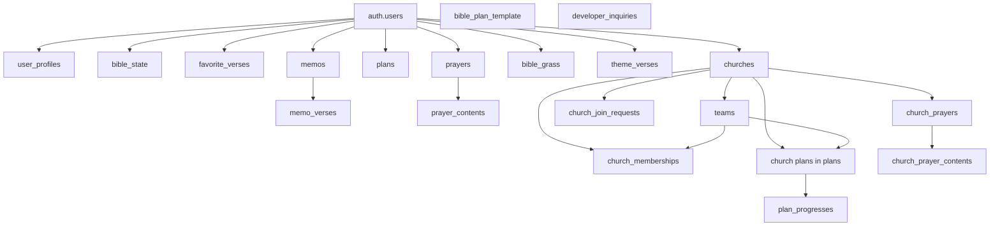

# We Bible App DB 인수인계 문서

작성 기준일: 2026-08-20

## 1. 문서 목적

이 문서는 `we-bible-app`의 현재 데이터 저장 구조를 빠르게 파악하고, 이후 기능 추가/운영/마이그레이션 작업 시 어디를 수정해야 하는지 한 번에 이해할 수 있도록 정리한 인수인계용 문서다.

이 프로젝트의 데이터 계층은 단순한 "Supabase 하나"가 아니라 아래 2계층으로 구성된다.

- 서버 주 저장소: Supabase Postgres + Supabase Auth
- 로컬 보조 저장소: Expo SQLite

핵심 포인트는 다음과 같다.

- 교회 관련 데이터는 Supabase를 직접 사용한다.
- 개인 데이터는 SQLite와 Supabase를 함께 쓰는 하이브리드 구조다.
- 비로그인 상태에서는 SQLite가 단독 저장소 역할을 한다.
- 로그인 이후에는 SQLite 데이터를 Supabase에 시드하거나, Supabase 데이터를 SQLite로 hydration 하는 흐름이 존재한다.

## 2. 스키마 소스 오브 트루스

실제 DB 구조를 수정할 때 기준이 되는 파일은 아래 순서로 이해하면 된다.

1. `supabase/schema.sql`
2. `supabase/migrations/*.sql`
3. `supabase/fresh-db/*`

정리:

- `schema.sql`: 현재 최종 스키마 전체본
- `migrations/*`: 운영/개발 DB에 순차 적용하는 변경 이력
- `fresh-db/*`: 새 Supabase 프로젝트를 처음 세팅할 때 쓰는 최종 정리본

주의:

- 기존 DB 변경에는 반드시 `migrations/*`를 추가해야 한다.
- 새 DB 부트스트랩에는 `fresh-db`를 순서대로 실행한다.
- 스키마 변경 시 `schema.sql`, `migrations`, `fresh-db`를 같이 맞춰야 한다.

## 3. 전체 구조 요약

### 3.1 서버 DB 도메인 맵

### 3.2 로컬 SQLite 도메인 맵

SQLite에는 현재 아래 개인 데이터만 존재한다.

- 앱 상태: `bible_state`
- 즐겨찾기: `favorite_verses`
- 메모: `memos`, `memo_verses`
- 개인 성경읽기표: `plans`
- 개인 기도제목: `prayers`, `prayer_contents`
- 잔디 데이터: `bible_grass`
- 연간 테마 구절: `theme_verses`

중요:

- 교회/팀/공용 읽기표/교회 기도제목 관련 테이블은 SQLite에 없다.
- 즉, 교회 도메인은 서버 중심 구조이고, 개인 도메인만 하이브리드 구조다.

## 4. 서버 테이블 카탈로그

### 4.1 개인 사용자 도메인

| 테이블 | 용도 | PK | 주요 FK | 주요 컬럼/특징 |
| --- | --- | --- | --- | --- |
| `bible_state` | 사용자 앱 설정 및 성경 화면 상태 저장 | `user_id` | `auth.users.id` | `app_theme`, `app_language`, `bible_search_info(jsonb)` |
| `favorite_verses` | 즐겨찾기 구절 저장 | `(user_id, book_code, chapter, verse)` | `auth.users.id` | 구절 텍스트와 생성일 포함 |
| `memos` | 메모 본문 저장 | `id` | `auth.users.id` | `client_id`로 로컬-원격 매핑, `verse_text` 포함 |
| `memo_verses` | 메모와 성경 구절 매핑 | `(user_id, memo_id, book_code, chapter, verse)` | `memos.id`, `auth.users.id` | 한 메모에 여러 절 연결 가능 |
| `plans` | 개인/교회/팀 성경읽기표 원본 저장 | `id` | `auth.users.id`, `churches.id`, `teams.id` | `church_id/team_id`가 `null`이면 개인 읽기표 |
| `prayers` | 개인 기도제목 저장 | `id` | `auth.users.id` | `is_my_prayer`, `relation`, `target`, `client_id` |
| `prayer_contents` | 개인 기도제목의 내용/업데이트 이력 | `id` | `prayers.id` | `client_id`, `registered_at` |
| `bible_grass` | 날짜별 성경 읽기 잔디 데이터 | `(user_id, date)` | `auth.users.id` | `data(jsonb)`에 실제 일자 데이터 저장 |
| `theme_verses` | 연도별 테마 구절 저장 | `id` | `auth.users.id` | `year` 유니크, `verse_numbers(jsonb)`, `description` |

### 4.2 사용자 프로필/공통 도메인

| 테이블 | 용도 | PK | 주요 FK | 주요 컬럼/특징 |
| --- | --- | --- | --- | --- |
| `user_profiles` | 앱 내 공개 프로필 저장 | `user_id` | `auth.users.id` | `display_name`, `email`, `show_email`, `avatar_url` |
| `bible_plan_template` | 읽기표 템플릿 마스터 | `id` | 없음 | `language_code`, `selected_book_codes(jsonb)` |
| `developer_inquiries` | 개발자 문의 저장 | `id` | `auth.users.id` nullable | `status`, `answer_content`, 읽기 정책 없음 |

### 4.3 교회 도메인

| 테이블 | 용도 | PK | 주요 FK | 주요 컬럼/특징 |
| --- | --- | --- | --- | --- |
| `churches` | 교회 마스터 | `id` | `created_by_user_id`, `super_admin_user_id` -> `auth.users.id` | `description`, `member_count`, `deputy_admin_user_ids`, `shared_plan_ranking_public`, `shared_plan_progress_public` |
| `teams` | 교회 내 팀 | `id` | `churches.id`, `leader_user_id` -> `auth.users.id` | 팀명은 교회 내 유니크 |
| `church_memberships` | 교회 회원/역할/팀 배정 | `(church_id, user_id)` | `churches.id`, `teams.id`, `auth.users.id` | `role`은 `super_admin/deputy_admin/member` |
| `church_join_requests` | 교회 가입 신청 | `id` | `churches.id`, `requester_user_id`, `processed_by_user_id` | `status`는 `pending/approved/rejected/cancelled` |
| `plan_progresses` | 공용 읽기표별 회원 진행도 | `(plan_id, user_id)` | `plans.id`, `auth.users.id` | `goal_status`, `goal_percent`, `rest_day` 등 계산 결과를 중복 저장 |
| `church_prayers` | 교회/팀 기도제목 | `id` | `churches.id`, `teams.id`, `created_by_user_id` | `team_id`가 `null`이면 교회 전체 대상 |
| `church_prayer_contents` | 교회 기도제목 업데이트 이력 | `id` | `church_prayers.id`, `created_by_user_id` | 등록 시 상위 기도제목 `updated_at` 동기화 |

## 5. 핵심 테이블 상세 메모

### 5.1 `plans`

`plans`는 이 프로젝트에서 가장 중요한 중심 테이블이다.

한 테이블로 아래 3종류를 모두 표현한다.

- 개인 읽기표: `church_id = null`, `team_id = null`
- 교회 공통 읽기표: `church_id != null`, `team_id = null`
- 팀 읽기표: `church_id != null`, `team_id != null`

주요 컬럼:

- 원본 메타데이터: `plan_name`, `plan_description`, `start_date`, `end_date`
- 계산 결과: `total_read_count`, `current_read_count`, `goal_percent`, `read_count_per_day`, `rest_day`
- 진행도 원본: `goal_status(jsonb)`
- 범위 정의: `church_id`, `team_id`
- 로컬-원격 연결: `client_id`

운영 포인트:

- 개인 읽기표는 `plans` 하나만으로 진행도까지 저장한다.
- 공용 읽기표는 원본은 `plans`, 개인별 진행도는 `plan_progresses`에 분리된다.

### 5.2 `plan_progresses`

공용 읽기표의 회원별 체크 상태를 저장한다.

역할:

- 공용 읽기표 참여자별 진행도 저장
- 모달/랭킹/팀 평균 계산의 원천 데이터

중요:

- `goal_status`뿐 아니라 `current_read_count`, `goal_percent`, `read_count_per_day`, `rest_day`까지 중복 저장한다.
- 즉, 조회 속도를 위해 계산 결과를 materialized-like 하게 보관하는 구조다.
- 순위 자체는 DB에 저장하지 않고, 앱 클라이언트에서 계산한다.

### 5.3 `churches`

정규화되지 않은 캐시 컬럼이 일부 있다.

- `member_count`: 회원 수 캐시
- `deputy_admin_user_ids`: 부관리자 목록을 CSV 문자열로 캐시

운영 포인트:

- 이 값들은 트리거/헬퍼 함수로 동기화된다.
- 정규화된 실제 원본은 `church_memberships`다.
- 따라서 데이터 정합성 문제 시 `church_memberships`를 기준으로 봐야 한다.

### 5.4 `user_profiles`

이 테이블은 일반적인 "전체 프로필 공개" 구조가 아니다.

- 직접 `select`는 기본적으로 자기 자신만 가능
- 타인 프로필 노출은 `get_visible_user_profiles(uuid[])` RPC를 통해 우회
- 이메일은 `show_email`이 켜져 있거나 본인일 때만 노출

즉, 앱에서 프로필이 안 보이는 문제는 단순 테이블 조회보다 RLS/RPC 경로를 먼저 봐야 한다.

### 5.5 `developer_inquiries`

이 테이블은 일반 사용자 입장에서 사실상 "쓰기 전용"에 가깝다.

- RLS에 `insert` 정책만 존재
- `select/update/delete` 정책이 없다

따라서 운영자 화면이나 백오피스가 붙는다면:

- service role
- Edge Function
- 별도 admin API

중 하나가 필요하다.

## 6. 로컬 SQLite 구조

SQLite 스키마는 `lib/sqlite-supabase-store.ts`에서 생성한다.

### 6.1 로컬 테이블 목록

| SQLite 테이블 | 역할 | 비고 |
| --- | --- | --- |
| `bible_state` | key-value 형태의 앱 상태 저장 | 테마, 언어, 검색 상태, hydration 메타값도 저장 |
| `favorite_verses` | 즐겨찾기 구절 | 서버와 거의 동일 구조 |
| `memos` | 메모 | 서버 `memos`의 로컬 버전 |
| `memo_verses` | 메모 구절 매핑 | 서버 `memo_verses`의 로컬 버전 |
| `plans` | 개인 읽기표 | 교회/팀 공용 읽기표는 저장하지 않음 |
| `prayers` | 개인 기도제목 | 서버 `prayers`의 로컬 버전 |
| `prayer_contents` | 개인 기도 내용 | 서버 `prayer_contents`의 로컬 버전 |
| `bible_grass` | 잔디 데이터 | `__meta__` 행을 추가로 사용 |
| `theme_verses` | 연간 테마 구절 | `year` 유니크 |

### 6.2 SQLite 내부 메타 키

`bible_state`에 일반 앱 상태 외 메타 키도 저장한다.

- `activeDataUserId`
- `lastAutoSyncAt`
- `hydratedSliceUserId:{slice}`
- `pendingBibleNavigation`
- `pointTotal`
- `grassColorTheme`

즉, `bible_state`는 단순 사용자 설정 테이블이 아니라 앱 내부 동기화 상태 저장소 역할도 겸한다.

## 7. 인증/저장소 동작 방식

현재 코드 기준 개인 데이터 흐름은 아래와 같다.

### 7.1 비로그인 상태

- SQLite만 사용
- 개인 데이터는 모두 로컬에 저장

### 7.2 로그인 직후 초기 부트스트랩

`bootstrapSupabaseUserData(db, userId)` 기준:

1. 로컬에 과거 로그인 사용자 스냅샷이 있으면 초기화
2. 현재 로컬 SQLite 스냅샷 조회
3. Supabase에 사용자 데이터가 하나라도 있는지 slice별 확인
4. Supabase 데이터가 있으면 서버 데이터를 기준으로 사용
5. Supabase 데이터가 없으면 로컬 SQLite 데이터를 Supabase로 업로드

### 7.3 로그인 이후 개인 데이터

현재 구조는 "로그인하면 SQLite를 완전히 버리는 구조"가 아니다.

- 부족한 slice는 Supabase에서 불러와 SQLite에 hydration
- 이후 개인 데이터 변경은 SQLite에서 읽고 쓰면서
- `queuePersistedSlicesSave()`를 통해 Supabase로 비동기 동기화

즉, 현재 개인 도메인은 다음과 같이 이해하는 것이 정확하다.

- SQLite: 로컬 working set / 캐시 / 비로그인 저장소
- Supabase: 계정 영속 저장소

### 7.4 교회 도메인

교회 기능은 SQLite를 사용하지 않고 Supabase 직접 조회/수정 구조다.

포함 기능:

- 교회 생성/수정
- 교인 관리
- 팀 관리
- 공용 읽기표 생성/수정
- 공용 읽기표 진행도 조회
- 교회 기도제목

## 8. RLS 정책 요약

### 8.1 Owner-only 테이블

아래 테이블은 기본적으로 본인 데이터만 접근 가능하다.

- `bible_state`
- `favorite_verses`
- `memos`
- `memo_verses`
- `prayers`
- `prayer_contents`
- `bible_grass`
- `theme_verses`

### 8.2 읽기표 관련

- `plans`
  - 개인 읽기표: 본인만 접근
  - 공용 읽기표: 같은 교회 구성원은 조회 가능
  - 생성/수정/삭제: 교회 공용은 관리자만 가능

- `plan_progresses`
  - 본인 진행도는 본인이 조회/수정 가능
  - 같은 교회 구성원은 조회 가능
  - 수정은 본인 + 해당 읽기표 대상자만 가능

### 8.3 교회 관련

- `churches`
  - 인증 사용자 전체 읽기 가능
  - 수정은 `super_admin`만 가능

- `teams`
  - 교회 구성원 읽기 가능
  - 관리자(`super_admin`, `deputy_admin`)가 관리 가능

- `church_memberships`
  - 본인 또는 같은 교회 구성원이 읽기 가능
  - 추가는 관리자
  - 수정/삭제는 사실상 `super_admin` 중심

- `church_join_requests`
  - 신청자 본인 또는 교회 관리자 조회 가능
  - 생성은 본인만 가능
  - 처리(update)는 관리자

- `church_prayers`, `church_prayer_contents`
  - 교회/팀 audience 기준 접근
  - 생성자는 관리 가능
  - 교회 관리자도 관리 가능

### 8.4 프로필 관련

- `user_profiles`는 직접 읽기 정책이 엄격하다.
- 앱은 보통 `get_visible_user_profiles()` RPC로 필요한 사용자만 가져온다.

### 8.5 운영 문의

- `developer_inquiries`는 `insert` 정책만 있다.
- 일반 사용자가 문의 등록은 가능하지만 목록 조회는 불가하다.

## 9. 주요 RPC 함수

| 함수 | 목적 | 비고 |
| --- | --- | --- |
| `create_church` | 교회 생성 + 생성자를 super admin으로 가입 | 교회 생성 직후 membership까지 생성 |
| `update_church_info` | 교회명/설명/공용 읽기표 공개 설정 수정 | super admin만 가능 |
| `set_team_leader` | 팀장 지정 | 지정 대상은 해당 팀 소속이어야 함 |
| `set_church_member_team` | 교인 팀 배정/변경 | 권한 검사 포함 |
| `remove_church_member` | 교인 탈퇴/강제 제거 | super admin은 제거 불가 |
| `transfer_church_super_admin` | 최고 관리자 위임 | 기존 admin 정리 로직 포함 |
| `delete_church_as_super_admin` | 교회 삭제 | 타 회원이 있으면 삭제 불가 |
| `delete_my_account` | 계정 삭제 | 교회/개인 데이터 정리 포함 |
| `get_visible_user_profiles` | 접근 가능한 사용자 프로필만 반환 | user profile 조회의 표준 진입점 |

핵심:

- 교회 권한이 엮인 쓰기 작업은 단순 `update/delete`보다 RPC 사용 비중이 높다.
- 권한/정합성 검사가 함수 안에 들어 있으므로, 교회 도메인 변경 시 RPC 수정 여부를 먼저 확인해야 한다.

## 10. 트리거와 동기화 함수

### 10.1 캐시/정합성 유지

- `sync_church_cached_fields(church_id)`
  - `member_count`
  - `deputy_admin_user_ids`
  - `updated_at`
  - 를 교회 테이블에 반영

- `handle_church_membership_change()`
  - membership 변경 후 캐시 갱신
  - 신규 교인에게 해당 공용 읽기표 `plan_progresses` 자동 생성

- `handle_plan_audience_change()`
  - 공용 읽기표 생성/범위 변경 시 대상자용 `plan_progresses` 자동 생성

- `cleanup_team_leader_on_membership_change()`
  - 팀 이동/탈퇴 시 팀장 정리

### 10.2 교회 기도제목 정합성

- `validate_church_prayer_team_scope()`
  - 팀 기도제목의 `team_id`가 같은 교회 소속인지 검사

- `sync_church_prayer_updated_at_from_content()`
  - 댓글/내용 추가 시 상위 기도제목 `updated_at` 갱신

### 10.3 일반 updated_at 관리

`touch_updated_at()` 트리거가 아래 테이블에 붙어 있다.

- `user_profiles`
- `churches`
- `teams`
- `church_memberships`
- `plan_progresses`
- `developer_inquiries`

## 11. 주요 인덱스

전체는 `supabase/fresh-db/02_indexes.sql` 참고.

실무상 중요한 인덱스만 요약하면 아래와 같다.

### 11.1 동기화/중복 방지용

- `memos(user_id, client_id)` unique
- `plans(user_id, client_id)` unique
- `prayers(user_id, client_id)` unique
- `prayer_contents(prayer_id, client_id)` unique
- `theme_verses(user_id, client_id)` unique

의미:

- 로컬 SQLite와 Supabase 사이에서 `client_id`를 통해 idempotent하게 매핑하기 위한 설계다.

### 11.2 교회 기능 조회용

- `teams(church_id, name)` unique
- `church_memberships(user_id, joined_at desc)`
- `church_memberships(church_id, team_id)`
- `church_join_requests(church_id, status, requested_at desc)`
- `church_prayers(church_id, updated_at desc, id desc)`
- `church_prayers(team_id, updated_at desc, id desc)`
- `church_prayer_contents(prayer_id, registered_at desc, id desc)`
- `plan_progresses(user_id, updated_at desc)`

### 11.3 일반 목록 정렬용

- `memos(user_id, created_at desc, id desc)`
- `plans(user_id, id desc)`
- `developer_inquiries(status, created_at desc, id desc)`

## 12. 앱 코드에서의 실제 조회/조합 방식

### 12.1 개인 데이터

개인 데이터는 `lib/sqlite-supabase-store.ts`가 사실상 저장소 어댑터 역할을 한다.

여기서 담당하는 일:

- SQLite 테이블 생성
- SQLite -> Supabase 업로드
- Supabase -> SQLite hydration
- slice 단위 부분 동기화
- 로그인 사용자 기준 활성 데이터 전환

### 12.2 교회 데이터

교회 도메인은 `lib/church.ts`에 조회/조합 로직이 집중되어 있다.

특징:

- 여러 테이블을 나눠 조회한 뒤 앱에서 조합
- 프로필은 `get_visible_user_profiles()` RPC로 별도 조회
- 공용 읽기표 평균/개인 순위/팀 평균/팀 순위는 클라이언트에서 계산

즉, 현재 교회 도메인에서 순위/통계는 DB view/materialized view 기반이 아니라 앱 메모리 계산 방식이다.

## 13. 마이그레이션 이력 요약

| 날짜 | 파일 | 주요 변경 |
| --- | --- | --- |
| 2026-03-31 | `202603310001_church_admin_transfer_and_account_delete.sql` | 최고관리자 이관, 교회 삭제, 계정 삭제 로직 추가 |
| 2026-03-31 | `202603310002_fix_delete_my_account_shared_plan_owner.sql` | 계정 삭제 시 공용 읽기표 소유자 처리 보완 |
| 2026-04-01 | `202604010001_add_church_description_and_update_info.sql` | 교회 설명 추가, 교회 수정 RPC 보강 |
| 2026-04-01 | `202604010002_add_user_profile_show_email.sql` | 프로필 이메일 공개 여부 추가, 프로필 RPC 보강 |
| 2026-04-09 | `202604090001_add_developer_inquiries.sql` | 개발자 문의 테이블 추가 |
| 2026-04-10 | `202604100001_add_theme_verses.sql` | 연간 테마 구절 도입 |
| 2026-04-27 | `202604270001_add_prayer_relation.sql` | 개인/교회 기도제목 relation 컬럼 추가 |
| 2026-04-30 | `202604300001_add_plan_description_and_templates.sql` | 읽기표 설명, 템플릿 마스터 추가 |
| 2026-05-11 | `202605110001_add_is_my_prayer_to_prayers.sql` | 개인 기도 여부 추가 |
| 2026-08-20 | `202608200001_add_church_shared_plan_visibility.sql` | 공용 읽기표 순위/진행도 공개 설정 추가 |

## 14. 운영 시 주의사항

### 14.1 현재 구조는 완전한 "서버 단일 저장소"가 아니다

현재 개인 데이터는 SQLite와 Supabase를 같이 사용한다.

영향:

- 로그인 전후 데이터 차이 이슈가 발생할 수 있음
- 특정 slice만 hydration 안 된 경우 부분 불일치 가능
- 동기화 문제는 `sqlite-supabase-store.ts`부터 보는 것이 빠름

### 14.2 날짜/시간 타입이 혼재되어 있다

테이블에 따라:

- `timestamptz`
- `text`

가 섞여 있다.

예:

- `churches.created_at`: `timestamptz`
- `plans.created_at`: `text`
- `church_prayers.updated_at`: `text`

영향:

- 정렬/필터에서 형식 불일치 위험
- 서버 함수 작성 시 캐스팅 주의 필요

### 14.3 JSON/JSONB 비중이 높다

아래 컬럼은 앱 레벨 정규화 코드가 중요하다.

- `bible_state.bible_search_info`
- `plans.goal_status`
- `plans.selected_book_codes`
- `plan_progresses.goal_status`
- `theme_verses.verse_numbers`
- `bible_grass.data`

영향:

- 스키마 변경 시 SQL만 바꾸면 끝나지 않는다.
- TypeScript의 normalize 함수도 같이 수정해야 한다.

### 14.4 교회 통계/순위는 클라이언트 계산 방식이다

현재 `lib/church.ts`에서:

- 회원 순위
- 팀 평균
- 팀 순위
- 평균 진행도

를 전부 조회 후 계산한다.

영향:

- 교인 수가 많아질수록 교회 상세/공용 읽기표 상세 진입 속도가 느려질 수 있음
- 향후 성능 개선 포인트는 DB view/RPC 집계화다

### 14.5 `deputy_admin_user_ids`는 캐시다

실제 역할 원본은 `church_memberships.role`이다.

운영 시에는:

- 역할 조회/판정: `church_memberships`
- 화면 캐시/빠른 표시: `churches.deputy_admin_user_ids`

로 이해해야 한다.

## 15. 스키마 변경 체크리스트

새 컬럼/테이블/정책을 추가할 때는 아래를 같이 확인해야 한다.

1. `supabase/migrations`에 신규 SQL 추가
2. `supabase/schema.sql` 반영
3. `supabase/fresh-db/*` 반영
4. 관련 RLS 정책 추가/수정
5. 필요하면 grants/RPC/trigger/index 추가
6. 개인 데이터 도메인이면 `lib/sqlite-supabase-store.ts`의 SQLite 스키마도 반영
7. JSON 컬럼이면 normalize/parse 코드 반영
8. 앱 조회 조합 코드(`lib/church.ts` 등) 반영

## 16. 우선 확인 파일 목록

DB 관련 이슈가 생기면 아래 파일부터 보면 된다.

- `supabase/schema.sql`
- `supabase/migrations/*`
- `supabase/fresh-db/01_tables.sql`
- `supabase/fresh-db/02_indexes.sql`
- `supabase/fresh-db/03_functions_helpers.sql`
- `supabase/fresh-db/04_functions_sync.sql`
- `supabase/fresh-db/05_functions_rpc.sql`
- `supabase/fresh-db/06_triggers.sql`
- `supabase/fresh-db/07_grants.sql`
- `supabase/fresh-db/08_rls.sql`
- `lib/sqlite-supabase-store.ts`
- `lib/church.ts`
- `lib/plan-template.ts`
- `lib/supabase-client.ts`
- `lib/supabase.ts`

## 17. 한 줄 결론

이 프로젝트의 DB 구조는 "Supabase Postgres를 중심으로 하되, 개인 데이터는 SQLite와 동기화하는 하이브리드 구조"이며, 교회 기능은 Supabase의 RLS + RPC + 트리거에 크게 의존한다.
