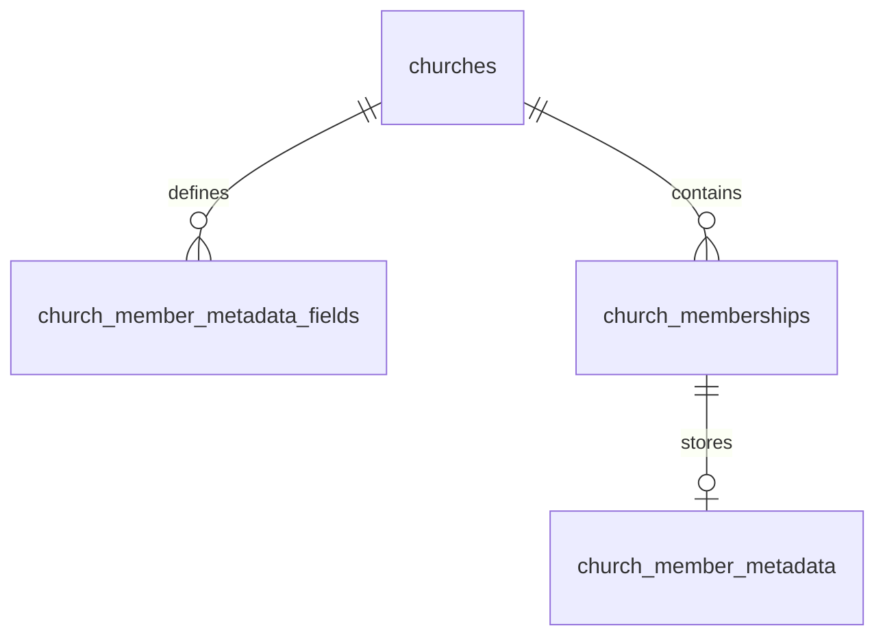

# 공동체 회원 메타데이터 기능 구현 계획

작성일: 2026-09-08  
상태: 사용자 승인에 따라 앱 코드·DB 마이그레이션 구현 완료(2026-09-09). 운영 DB에는 아직 적용하지 않았다. 실행 방법과 검증 범위는 [검증 기록](supabase/tests/README.md)을 참고한다.

## 1. 목표와 요구사항

공동체마다 관리할 회원 정보 항목을 정의하고, 각 회원의 값을 해당 공동체 안에서 별도로 관리한다. 동일한 회원이 여러 공동체에 가입해도 공동체별 항목과 값은 독립적이다.

| 요청 사항 | 계획 |
| --- | --- |
| 공동체 내 회원 메타데이터 | 공동체별 필드 정의와 공동체·회원별 값을 분리해서 관리 |
| 관리자 필드 추가 및 사용 여부 설정 | 관리자에게 추가·수정·사용/미사용 전환 화면 제공 |
| 추가한 필드 삭제 금지 | 필드 삭제 UI/API를 제공하지 않고, 앱의 DB 직접 삭제 권한도 차단 |
| 기본 항목 | 생년월일, 이메일, 성별, 연락처, 주소를 공동체마다 생성 |
| 필드 데이터 유형 | 텍스트, 숫자, 연락처, O/X를 지원하고 기본 항목에 필요한 날짜·이메일 유형도 제공 |
| O/X 선택지 설정 | 정확히 두 개의 선택지를 관리자가 설정. 예: 남/여, 예/아니오 |
| 필드별 복사 기능 여부 | 관리자가 각 필드의 복사 버튼 제공 여부를 설정. 회원 정보에서 연락처·이메일·주소 등을 복사 |
| 필드별 회원 정보 수정 권한 | 관리자만 / 관리자·부관리자 / 관리자·부관리자와 본인 / 공동체 모든 회원 중 선택 |
| 회원 메타데이터 검색 | 공동체 → 회원 목록에서 필드를 선택하고 해당 값으로 회원 검색 |
| 별도 테이블과 JSONB | `church_member_metadata_fields`와 `church_member_metadata` 신설 |

여기서 “기본값”은 **기본 제공 필드 목록**으로 해석한다. 실제 회원 값은 미입력 상태로 시작한다.

## 2. 현재 코드에서 확인한 구조

| 위치 | 현재 역할 및 연결 방향 |
| --- | --- |
| `supabase/schema.sql` | 공동체 `churches`, 회원 소속 `church_memberships`, 공통 프로필 `user_profiles` 정의 |
| `supabase/migrations/` | 기존 DB에 적용할 변경 이력. 이번 기능도 새 migration으로 추가 |
| `supabase/fresh-db/` | 신규 DB 구성용 테이블·함수·트리거·권한·RLS SQL. 구현 시 함께 갱신 |
| `lib/church.ts` | Supabase 공동체 조회와 변경, 공동체·회원 타입, 관리자 권한 플래그 |
| `hooks/use-churches.ts` | 공동체 React Query 조회와 변경 후 캐시 무효화 |
| `app/(tabs)/churches/[id]/index.tsx` | 회원 목록, 공동체 관리 메뉴, 회원별 작업 메뉴 |
| `components/churches/` | 공동체 관련 시트와 공통 UI |
| `utils/clipboard.ts` | 기존 `copyToClipboard` 함수. Web·네이티브 클립보드 복사에 재사용 |
| `utils/i18n.ts` | 한국어·영어 UI 문구 |

현재 관리자 역할은 `super_admin`과 `deputy_admin`이며, DB에 `is_church_member`, `is_church_admin`, `is_church_super_admin` 함수가 있다. 회원 소속의 기본 키는 `(church_id, user_id)`다.

공동체 데이터는 Supabase에서 직접 조회하고 React Query로 관리한다. 새 메타데이터도 이 방식을 따른다.

## 3. 검토용 정책 제안

이 절의 제안은 사용자의 구현 승인에 따라 구현 기준으로 채택했다.

| 항목 | 제안 정책 |
| --- | --- |
| 필드 정의 관리 | 최고 관리자와 부관리자가 항목을 관리하되, 수정 권한 정책 설정·변경은 최고 관리자만 가능 |
| 회원 값 수정 | 공동체 공통 설정이 아닌 필드별 네 가지 정책으로 결정. 상세 기준은 6.1절 참조 |
| 회원 값 조회 | 최고 관리자·부관리자와 정보 주체인 본인은 조회 가능. 모든 회원 수정 정책의 필드는 같은 공동체의 다른 회원도 조회 가능 |
| 수정 권한 초기 설정 | 기본·추가 필드 모두 `관리자·부관리자와 본인`으로 시작. 최고 관리자가 변경 가능 |
| 수정 대상의 역할 | 수정 가능한 대상에 최고 관리자·부관리자도 포함. 기존 역할 변경·강퇴 권한은 기존 규칙을 따름 |
| 회원 검색 범위 | 검색자가 조회할 수 있는 필드와 회원 값에만 적용. 일반 회원의 비공개 필드 검색은 본인 정보만 대상 |
| 기본 필드 상태 | 다섯 항목 모두 사용 상태, 입력은 모두 선택 사항 |
| 기본 필드 미사용 | 사용자 추가 필드와 동일하게 미사용 전환 가능 |
| 복사 기능 초기 설정 | 기본 이메일·연락처·주소는 켜짐, 생년월일·성별은 꺼짐. 관리자가 필드별로 변경 가능 |
| 미사용 필드 값 | DB에 보존. 기본 입력 화면에서는 제외하고, 접근 권한이 있는 사람이 과거 값 영역에서 읽기만 가능 |
| 회원 탈퇴·제외 | 해당 공동체에서의 회원 값은 소속 삭제와 함께 정리. 재가입하면 미입력부터 시작 |
| 필드 유형 변경 | 생성 후 변경 불가. 다른 유형이 필요하면 기존 필드를 미사용 처리하고 새 필드 추가 |
| 필드명·선택지 표시명 | 수정 가능. 기존 값에도 새 표시명이 적용된다는 점을 안내 |

필드 삭제 금지는 **공동체가 유지되는 동안 필드 정의를 개별 삭제하지 않는다는 의미**로 적용한다. 공동체 자체를 삭제하면 필드 정의와 회원 값도 함께 삭제한다. 회원 탈퇴 시에는 해당 회원의 값만 정리하고 공동체의 필드 정의는 유지한다.

## 4. 데이터 모델



필드 정의와 JSONB 내부 키의 연결은 저장 함수에서 검증한다. JSONB 내부 키에는 일반적인 관계형 외래 키를 직접 적용할 수 없으므로, 테이블 외래 키만으로 필드 유효성이 보장된다고 가정하지 않는다.

### 4.1. 필드 정의: `church_member_metadata_fields`

공동체가 관리하는 필드 하나당 한 행을 저장한다.

| 컬럼 | 유형 | 의미 |
| --- | --- | --- |
| `id` | `bigint`, identity, PK | 필드의 고정 식별자. JSONB에서는 문자열 키로 사용 |
| `church_id` | `bigint`, FK | `churches.id`, 공동체 삭제 시 cascade |
| `system_key` | `text`, nullable | 기본 필드 식별자. 사용자 추가 필드는 null |
| `label` | `text` | 표시 이름. 예: 생년월일, 결혼 여부 |
| `data_type` | `text` | `text`, `number`, `phone`, `binary`, `date`, `email` 중 하나 |
| `options` | `jsonb`, nullable | `binary`일 때 두 선택지의 고정 키와 표시명 |
| `is_active` | `boolean`, default true | 사용 여부 |
| `is_copyable` | `boolean`, not null, default false | 회원 정보 조회 화면에서 복사 버튼을 제공할지 여부 |
| `edit_policy` | `text`, not null, default `self_and_admins` | `super_admin_only`, `admins_only`, `self_and_admins`, `all_members` 중 하나 |
| `sort_order` | `integer` | 화면 표시 순서. 기본 필드 다음에 사용자 추가 필드 배치 |
| `version` | `integer`, default 1 | 정의 수정 시 증가하는 충돌 확인용 버전 |
| `created_by_user_id` | `uuid`, nullable, FK | 생성자. 계정 삭제 시 set null, 일괄 초기화는 null |
| `updated_by_user_id` | `uuid`, nullable, FK | 마지막 변경자. 계정 삭제 시 set null |
| `created_at`, `updated_at` | `timestamptz` | 생성·수정 시각 |

제약과 변경 규칙:

- `church_id`, `id`, `system_key`, `data_type`은 생성 후 변경할 수 없다.
- `(church_id, system_key)`에 유일성을 부여해 기본 필드 중복 생성을 막는다. 여러 사용자 추가 필드의 null은 허용한다.
- 필드명은 앞뒤 공백을 제거하고 빈 값을 거절한다. 동일 공동체에서 대소문자·앞뒤 공백만 다른 이름의 중복도 차단한다. 미사용 필드도 중복 검사에 포함해 기존 필드 재사용을 유도한다.
- `binary`는 서로 다른 고정 키와 비어 있지 않은 서로 다른 표시명을 가진 선택지가 정확히 두 개여야 한다. 다른 유형의 `options`는 null이다.
- 선택지 고정 키는 생성 후 추가·삭제·교체하지 않는다. 표시명 수정으로 기존 값의 의미를 다른 항목으로 바꾸거나 두 선택지의 의미를 맞바꾸지 않도록 안내한다.
- `is_copyable`은 모든 유형에서 설정 가능하며, 관리자만 변경한다. 앱은 boolean을 전달하고 RPC는 boolean 인자와 null 거절로 검증한다. 변경 시 필드 정의 버전을 증가시키되 회원 값은 변경하지 않는다.
- `edit_policy`는 네 가지 값만 허용하는 CHECK 제약을 둔다. “별도 권한 설정 하지 않음”도 명시적인 `all_members` 값으로 저장하며 null·알 수 없는 값을 전체 허용으로 해석하지 않는다.
- 최고 관리자는 필드 생성·수정 시 `edit_policy`를 설정할 수 있다. 부관리자가 필드를 생성하면 서버가 기본 정책을 적용하고, 기존 필드의 정책 변경 요청은 거절한다. 부관리자가 자신에게 없는 값 수정 권한을 설정 변경으로 획득하지 못하도록 한다.
- 정책 변경 시 필드 정의 버전을 증가시키며 기존 회원 값은 보존한다. 미사용 여부가 수정 정책보다 우선하므로 미사용 필드는 누구도 값을 수정할 수 없다.
- 필드 관리 화면과 RPC에는 삭제 동작을 만들지 않는다. 직접 테이블 쓰기를 제한해 유형·선택지 키 변경 우회도 막는다.
- 목록 조회를 위해 `(church_id, is_active, sort_order, id)` 인덱스를 둔다.

### 4.2. 회원별 값: `church_member_metadata`

회원 한 명이 공동체 하나에서 가진 모든 메타데이터 값을 한 행에 저장한다.

| 컬럼 | 유형 | 의미 |
| --- | --- | --- |
| `church_id` | `bigint` | 공동체 식별자 |
| `user_id` | `uuid` | 회원 식별자 |
| `values` | `jsonb`, default `{}` | `{ "필드 ID": 값 }` 객체 |
| `version` | `integer`, default 1 | 값 저장 시 증가하는 충돌 확인용 버전 |
| `updated_by_user_id` | `uuid`, nullable, FK | 마지막 변경자. 계정 삭제 시 set null |
| `created_at`, `updated_at` | `timestamptz` | 생성·수정 시각 |

- 기본 키는 `(church_id, user_id)`다.
- 같은 두 컬럼으로 `church_memberships(church_id, user_id)`를 참조하는 복합 FK를 두고 `ON DELETE CASCADE`를 적용한다. 가입 전이거나 탈퇴한 회원의 값 생성을 막는다.
- `values`는 반드시 JSON 객체여야 한다. 키는 그 공동체의 필드 ID여야 한다.
- 값 행이 없으면 미입력 상태로 취급하고 첫 저장 시 생성한다. 기존 회원과 신규 가입 회원의 빈 행을 미리 대량 생성할 필요는 없다.
- 값 없음은 해당 키의 부재로 통일한다. 저장 요청의 null은 해당 키를 제거하라는 의미로 사용한다.
- 회원 단위 조회와 검색 모두 복합 PK의 `church_id` 범위로 제한한다. 숫자·날짜·O/X의 정확 일치 검색에 사용할 JSONB 조건과 GIN 인덱스 필요성을 실제 실행 계획으로 검토한다. 텍스트·연락처의 부분 일치에도 동일한 인덱스가 효과적이라고 가정하지 않으며, 대표 규모의 데이터로 검색 성능을 확인한다.

예시: 필드 ID가 생년월일 `101`, 이메일 `102`, 성별 `103`, 연락처 `104`, 주소 `105`, 결혼 여부 `106`, 자녀 수 `107`인 경우:

```json
{
  "101": "1992-04-16",
  "102": "member@example.com",
  "103": "option_1",
  "104": "010-1234-5678",
  "105": "서울특별시 …",
  "106": "option_2",
  "107": 0
}
```

성별 필드의 선택지 정의는 다음과 같이 저장한다. 결혼 여부는 같은 구조에서 표시명을 `예`, `아니오`로 설정할 수 있다.

```json
[
  { "value": "option_1", "label": "남" },
  { "value": "option_2", "label": "여" }
]
```

O/X는 두 값 중 하나를 선택하는 유형이다. 저장값은 선택지 고정 키이며, 사용자가 아직 선택하지 않은 상태는 별도로 유지한다. 첫 번째 선택지를 자동으로 선택하거나 미입력을 두 번째 선택지로 간주하지 않는다.

## 5. 기본 필드와 유형별 입력

| 기본 필드 | `system_key` | 유형 | 초기 선택지·값 | 복사 기능 초기 설정 |
| --- | --- | --- | --- | --- |
| 생년월일 | `birth_date` | `date` | 값 없음 | 꺼짐 |
| 이메일 | `email` | `email` | 값 없음 | 켜짐 |
| 성별 | `gender` | `binary` | 남 / 여, 값 없음 | 꺼짐 |
| 연락처 | `phone` | `phone` | 값 없음 | 켜짐 |
| 주소 | `address` | `text` | 값 없음, 여러 줄 입력 지원 | 켜짐 |

사용자 추가 필드는 연락처·이메일 유형을 선택하면 복사 기능을 기본으로 켜고, 다른 유형은 끈 상태로 제안한다. 관리자는 저장 전에 원하는 상태로 변경할 수 있다. 기본 주소 필드는 텍스트 유형이지만 초기화 시 복사 기능을 명시적으로 켠다. 저장 후에는 유형별 기본값보다 관리자가 저장한 설정을 우선한다.

기본 다섯 필드와 사용자 추가 필드의 수정 권한은 `self_and_admins`로 시작한다. 최고 관리자가 필드별로 다른 정책을 저장한 경우에는 저장한 설정을 유지한다.

| 유형 | 저장 형태 | 입력 및 검증 |
| --- | --- | --- |
| 텍스트 | JSON string | 텍스트 입력, 앞뒤 공백 정리, 빈 입력은 값 비우기 |
| 숫자 | JSON number | 소수·음수 입력 지원, 유효한 유한 숫자만 허용. `0`을 값 없음으로 처리하지 않음 |
| 연락처 | JSON string | 전화번호 키보드, 앞자리 0·국가번호 유지. 숫자 변환 금지 |
| O/X | JSON string | 설정된 두 선택지 중 하나만 허용. 선택 해제로 값 비우기 가능 |
| 날짜 | JSON string | `YYYY-MM-DD`, 실제 존재하는 날짜 검사, 시간대 변환 없음. 생년월일은 미래 날짜 거절 |
| 이메일 | JSON string | 이메일 키보드와 기본 형식 검사. 로그인 이메일 변경과는 별개 |

연락처는 `+`, 숫자, 공백, 하이픈, 괄호 등 전화번호 표기에 필요한 문자만 허용하되 국내 휴대전화 길이 하나로 제한하지 않는다. 숫자는 앱에서 정확히 처리할 수 있는 범위를 검증하며, 긴 식별번호처럼 정밀도 보존이 필요한 값은 텍스트 유형으로 입력하도록 안내한다.

필드명·선택지·텍스트의 길이와 요청 크기에 상한을 두고 클라이언트와 서버에 동일하게 적용한다. 검증 실패는 자동 변환이나 잘라내기 없이 해당 항목의 오류로 표시한다.

`user_profiles.email`과 `show_email`은 기존 공개 프로필 정책을 유지한다. 메타데이터 이메일을 일반 회원 목록의 프로필 이메일 표시 대체값으로 사용하지 않는다. 로그인 프로필에서 값을 자동 복사하지 않으며, 회원 정보 화면에는 정책에 따른 조회·수정 범위를 안내한다. 검색 결과의 메타데이터 이메일은 해당 필드의 조회 권한을 적용하고 프로필 이메일과 구분해서 표시한다.

## 6. 조회·변경 API와 권한

### 6.1. 필드별 수정 권한

요청의 “관리자만”은 기존 `super_admin`(최고 관리자)을 뜻한다. “관리자/부관리자”는 `super_admin`과 `deputy_admin`을 뜻한다. 아래는 **사용 중인 필드의 회원 값 수정** 기준이며, 필드 정의 자체를 수정하는 권한과 구분한다.

| 설정 표시명 | 저장값 | 최고 관리자 | 부관리자 | 일반 회원 |
| --- | --- | --- | --- | --- |
| 관리자만 정보 수정 가능 | `super_admin_only` | 모든 회원 값 수정 | 수정 불가, 본인 값도 포함 | 수정 불가, 본인 값도 포함 |
| 관리자/부관리자만 정보 수정 가능 | `admins_only` | 모든 회원 값 수정 | 모든 회원 값 수정 | 수정 불가, 본인 값도 포함 |
| 회원이 자신의 정보 수정 가능 | `self_and_admins` | 모든 회원 값 수정 | 모든 회원 값 수정 | 본인 값만 수정 |
| 별도의 권한 설정 하지 않음 | `all_members` | 모든 회원 값 수정 | 모든 회원 값 수정 | 서로의 값 수정 가능 |

- 세 번째 항목은 기존 관리 업무를 유지하면서 회원 본인도 수정할 수 있도록 하는 제안이다. UI 보조 설명에 “관리자·부관리자는 모든 회원, 일반 회원은 본인 정보만 수정할 수 있습니다.”를 표시한다.
- 네 번째 항목의 “모두”는 **현재 같은 공동체에 가입된 회원**이다. 비로그인 사용자·가입 대기자·탈퇴자·다른 공동체 회원은 포함하지 않는다.
- 값 비우기도 수정이므로 동일한 정책을 적용한다. 요청에 권한 없는 필드가 하나라도 포함되면 전체 저장을 거절한다.
- 최고 관리자만 수정 권한 정책을 설정·변경하도록 제안한다. 부관리자는 정책을 볼 수 있고 기존에 허용된 필드명·사용 여부·복사 여부 등은 관리할 수 있다.

### 6.2. 조회·검색 범위와 RLS

두 테이블 모두 RLS를 활성화한다.

| 데이터 | 조회 가능한 사람 |
| --- | --- |
| 필드 정의 | 해당 공동체 회원. 사용 여부를 포함해서 조회 가능 |
| 회원 값: 최고 관리자·부관리자 | 해당 공동체 모든 회원의 필드 값. 수정 권한이 없는 필드도 읽기는 가능 |
| 회원 값: 일반 회원 본인 | 본인의 모든 필드 값. 수정 권한이 없는 필드도 읽기는 가능 |
| 회원 값: 다른 일반 회원 | `all_members` 정책인 필드 값만 조회 가능 |
| 다른 공동체 데이터 | 접근 불가 |
| 비로그인·가입 신청 중인 사용자 | 접근 불가 |

수정 권한을 넓힐 때 필요한 조회 범위도 위 기준으로 함께 제공한다. 독립적인 열람 권한 설정 UI는 추가하지 않는다. 최고 관리자가 `all_members`를 선택할 때 같은 공동체의 모든 회원이 해당 필드 값을 조회·검색·수정할 수 있다는 설명을 표시한다.

필드 미사용은 입력·활용 상태이며 별도의 비밀 정보 등급이 아니다. 조회 권한이 있는 필드의 미사용 값은 보관된 정보에서 읽을 수 있지만 검색·수정·앱 복사 버튼 대상에서는 제외한다.

필드 정의는 RLS가 적용되는 Supabase 조회를 사용한다. 회원 값 테이블의 직접 SELECT 정책은 본인 또는 최고 관리자·부관리자에게만 허용하고, 일반 회원에게 다른 회원의 JSONB 전체를 개방하지 않는다. **앱의 회원 값 조회는 필드별로 응답을 제한하는 전용 RPC로 통일**한다.

- 서버에서 `can_read_church_member_metadata_field`와 `can_edit_church_member_metadata_field`에 해당하는 공통 내부 판정 함수를 만들고 상세 조회·저장·검색에 재사용한다.
- 조회 RPC는 현재 사용자·대상 회원의 소속을 확인하고, 조회 가능한 키만 포함한 값과 해당 필드별 `can_edit`, 버전 정보를 반환한다. 없는 값과 권한상 미반환인 필드를 구분한다.
- RLS는 JSONB 내부 키를 가려주지 않으므로 클라이언트에서 숨기는 방식에 의존하지 않는다. 다른 회원에게 공개되는 키만 서버에서 구성한다.
- 회원 값은 개별 상세 또는 서버 검색 결과에서 필요한 항목만 반환하며, 기존 `fetchChurchDetail`의 전체 회원 목록 응답에는 전체 JSONB를 포함하지 않는다.
- 검색 조건 비교·결과 값·일치 인원 수 모두 같은 조회 권한을 적용한다. 읽을 수 없는 값은 검색 일치 여부로도 노출하지 않는다.

### 6.3. 조회·변경·검색 RPC

테이블 직접 INSERT/UPDATE/DELETE는 앱 역할에 허용하지 않고, 검증을 거치는 전용 RPC만 제공한다. 함수명은 다음을 기준으로 구현한다.

| 함수 | 역할 |
| --- | --- |
| `create_church_member_metadata_field` | 최고 관리자·부관리자 확인 후 필드 생성. 선택지·복사 설정 검증, 정책 지정은 최고 관리자만 허용 |
| `update_church_member_metadata_field` | 필드 정의 수정 및 버전 비교. 수정 권한 정책 변경은 최고 관리자만 허용 |
| `get_church_member_metadata` | 조회 가능한 필드의 값·필드별 수정 가능 여부·버전을 반환 |
| `save_church_member_metadata` | 변경하는 각 필드의 현재 정책을 확인하고 허용된 값만 검증·저장 |
| `search_church_members_by_metadata` | 공동체·필드·검색값을 검증하고 조회 가능한 회원 값에서 검색·페이지 조회 |
| `_seed_church_member_metadata_fields` | 기본 필드 생성용 내부 함수. 앱에서 직접 실행 불가 |

- 권한은 클라이언트가 보낸 사용자 ID나 권한 플래그 대신 `auth.uid()`와 현재 소속·역할로 판단한다. 대상 회원 ID와 작업자 ID를 구분한다.
- `SECURITY DEFINER`를 사용할 경우 고정된 `search_path`, 명시적인 소속·권한 검사, 함수 실행 권한 제한을 적용한다.
- 공개 실행 권한과 비로그인 실행 권한을 제거하고, 앱용 RPC만 `authenticated`에 허용한다. 내부 초기화·검증 함수는 외부 호출을 막는다.
- 필드 생성자·변경자·버전·시간은 서버에서 설정한다. 클라이언트가 임의로 주입할 수 없게 한다.
- RPC 저장 응답도 조회 응답과 같은 필드 필터링을 적용한다. `all_members` 필드를 수정한 일반 회원에게 대상 회원의 다른 비공개 키를 반환하지 않는다.

### 6.4. 저장·동시 수정 규칙

회원 저장은 JSONB 전체 교체 대신 `patch` 방식으로 처리한다.

1. 현재 사용자와 대상 회원이 현재 같은 공동체의 회원인지 확인한다.
2. 요청의 각 필드가 해당 공동체 소속이고 사용 중인지, 작업자가 현재 `edit_policy`에 따라 대상 회원의 값을 수정할 수 있는지 확인한다. 알 수 없는 키, 다른 공동체 키, 미사용 키, 수정 권한 없는 키의 변경은 거절한다.
3. 필드 유형과 선택지에 맞게 값을 검증한다. 배열·중첩 객체·허용하지 않은 선택지 값은 거절한다.
4. 요청에 빠진 키는 유지하고, null로 전달된 키는 제거한다. 미사용 필드의 기존 값도 유지한다.
5. 화면에서 읽은 회원 값 버전과 편집한 필드 정의 버전을 확인하고, 변경된 경우 충돌 오류를 반환한다. 없는 값 행의 버전은 `0`으로 취급한다.
6. 모든 항목이 유효한 경우에만 한 트랜잭션으로 저장하고 새로운 버전과 값을 반환한다. 일부 항목만 저장하지 않는다.

필드 수정과 값 저장 간에는 관련 정의 행 잠금을 사용해 검증 도중 미사용·수정 권한 정책 변경이 끼어드는 상황을 제어한다. 작업자와 대상 소속 행도 일관된 순서로 잠가 역할 변경·탈퇴와 저장을 직렬화한다. 값 행이 아직 없는 경우의 동시 첫 저장도 소속 행 잠금·복합 PK·버전 검사를 조합해 한 요청만 성공하도록 한다. 잠금 순서를 통일하고 동시 요청으로 검증한다.

충돌 시 입력 내용을 유지한 채 최신 데이터를 다시 확인하도록 안내한다. 네트워크 실패·권한 변경·필드 미사용 전환을 성공으로 처리하지 않는다.

### 6.5. 메타데이터 검색 계약

- 입력은 `church_id`, `field_id`, 유형에 맞는 검색값, 페이지 크기·위치로 구성한다. 필드명은 UI 선택에 사용하고 DB 검색에는 고정 필드 ID를 전달한다.
- 서버에서 현재 공동체 소속과 필드 소속·사용 여부를 확인하고 필드 정의의 유형을 기준으로 비교한다. 검색자가 조회할 수 있는 `(대상 회원, 필드)` 조합만 검색한다.
- 초기 범위는 **필드 하나 + 값 하나**의 조건이다. 예: `주소`에 `서울` 포함, `성별`이 `여`, `자녀 수`가 `0`인 회원 검색.

| 필드 유형 | 검색 방식 |
| --- | --- |
| 텍스트·이메일 | 앞뒤 공백 정리 후 대소문자를 구분하지 않는 부분 일치 |
| 연락처 | 저장값과 검색값의 표기 기호를 제외하고 숫자열로 부분 일치. 저장된 원문은 유지 |
| 숫자 | 검증된 JSON number로 정확 일치. `0`과 미입력 구분 |
| 날짜 | 유효한 `YYYY-MM-DD`로 정확 일치 |
| O/X | 설정된 선택지 중 하나를 선택하고 고정 키로 정확 일치 |

- 미입력 값은 일반 값 검색에 일치하지 않는다. 빈 검색 입력은 조건 해제로 처리하고 기존 회원 목록을 표시한다. 미입력만 찾기·범위 검색은 초기 범위에 포함하지 않는다.
- SQL에는 매개변수를 사용하고 클라이언트가 보낸 필드명·연산자를 SQL 조각으로 결합하지 않는다. 부분 일치에서 `%`, `_`, 역슬래시는 검색한 문자 자체로 취급한다. 연락처 검색은 숫자가 하나도 없으면 오류를 표시한다.
- 서버가 해당 공동체의 전체 회원 집합을 검색한다. 화면에 이미 로드된 회원만 클라이언트에서 필터링하지 않는다.
- 기본 30명, 최대 100명씩 조회하고 역할·표시 이름·회원 ID로 정렬 순서를 고정한다. 회원 ID, 선택한 필드의 조회 가능한 일치 값, 권한 적용 후 전체 일치 수와 카드 표시용 이름·역할·팀 이름을 반환한다. 기존 회원 목록 조회 한도를 넘는 회원도 검색 카드에 표시할 수 있도록 카드 요약 정보를 검색 응답에 포함했다.
- 필드가 미사용되거나 정책·소속이 변경된 뒤 요청하면 최신 기준으로 재검증한다. 검색 결과가 없으면 0건 상태를 표시하고, 요청 실패와 구분한다.

## 7. 화면 구성

### 7.1. 관리자: 회원 정보 항목 관리

- 진입: 공동체 상세의 관리 메뉴 → `회원 정보 항목 관리`.
- 화면: `app/(tabs)/churches/[id]/metadata-fields.tsx` 신설.
- 목록: 필드명, 유형, 기본 항목 여부, 사용/미사용, 복사 기능 및 수정 권한 정책 표시. 미사용 항목도 확인 가능.
- 추가: 필드명과 유형 선택. O/X 선택 시 두 선택지 표시명 입력란 제공. 초기 표시명은 `O`, `X`로 제공하고 저장 전 변경 가능.
- 추가·수정 폼에 `복사 기능 사용` 스위치를 제공하고 “회원 정보에서 이 항목의 값을 복사할 수 있습니다.”라고 안내.
- 최고 관리자에게 `정보 수정 권한` 선택란으로 6.1절의 네 가지 정책을 제공한다. 부관리자에게는 현재 정책을 읽기 전용으로 표시한다.
- 수정: 필드명, O/X 표시명, 사용 여부, 복사 기능 여부 및 허용된 수정 권한 정책을 수정. 유형과 고정 키는 변경 불가.
- 미사용 안내: “입력 항목에서 숨겨지며 기존 회원 정보는 보관됩니다.” 재사용하면 기존 값이 다시 표시됨.
- 필드가 모두 미사용이어도 빈 상태 화면과 항목 추가 버튼을 정상 표시.

### 7.2. 회원: 회원 정보 조회·편집

- 화면: `app/(tabs)/churches/[id]/members/[userId]/metadata.tsx` 신설.
- 관리자에게는 회원별 메뉴의 `회원 정보` 진입 제공.
- 일반 회원에게는 회원 탭의 `내 회원 정보` 진입 제공. 기존 본인 메뉴가 없는 경우에도 접근 가능하게 구성.
- 일반 회원도 다른 회원에게서 조회 가능한 `all_members` 필드가 있으면 해당 회원의 `회원 정보`로 진입할 수 있다.
- 서버가 반환한 조회 가능한 필드와 필드별 `can_edit`를 바탕으로 폼을 동적으로 생성. 수정 가능한 항목만 입력·값 비우기를 허용하고, 읽기만 가능한 항목에는 정책을 안내. 공통 입력 컴포넌트는 `components/churches/`에 분리.
- 기본 화면에 조회 가능한 현재 사용 항목을 표시하고, 조회 가능한 미사용 항목의 값은 접을 수 있는 `보관된 정보` 영역에서 읽기 전용으로 표시.
- 조회 상태에서는 복사 기능이 켜진 항목의 값 옆에 복사 버튼을 제공. 편집 중인 입력값과 혼동하지 않도록 편집 상태에서는 복사 버튼을 표시하지 않음.
- 모든 입력은 선택 사항이고, 수정 가능한 항목의 변경분만 저장 버튼으로 한 번에 반영. 수정 가능한 항목이 없으면 조회만 제공.
- 저장 중 중복 제출 방지, 항목별 오류, 변경 후 나가기 처리, 저장 실패 시 입력 보존 적용.
- 화면 재진입·다시 불러오기 시 필드와 소속 권한을 재확인. 조회 권한이 없어진 항목은 값·편집 초안·캐시를 제거하고, 수정 권한만 없어진 항목은 초안을 버리고 읽기 전용으로 전환.
- 한국어·영어, 다크 모드, 모바일 키보드, 긴 주소 입력을 기존 UI 방식에 맞춰 지원.

### 7.3. 회원 정보 복사 동작

- 해당 회원의 **해당 필드**를 조회할 권한이 있고, 필드가 사용 중이며, `is_copyable = true`이고 저장된 값이 있을 때만 복사 버튼을 표시한다. 미입력·복사 꺼짐·미사용 필드에는 표시하지 않는다. 숫자 `0`은 복사 가능한 값이다.
- 버튼을 누르면 필드명 없이 해당 값만 일반 텍스트로 복사한다. 연락처의 앞자리 0·국가번호·하이픈, 이메일 전체 문자열, 주소의 전체 내용과 줄바꿈을 보존한다. 화면에서 줄임표로 생략한 표시 문자열을 복사하지 않는다.
- 다른 유형도 관리자가 복사를 켜면 사용할 수 있다. O/X는 저장 키가 아닌 현재 선택지 표시명, 날짜는 `YYYY-MM-DD`, 숫자는 천 단위 구분자 없는 문자열로 복사한다.
- 기존 `utils/clipboard.ts`의 `copyToClipboard`를 재사용하고 별도 클립보드 라이브러리를 추가하지 않는다. 복사 완료 후 토스트를 표시하고, 클립보드 접근 실패 시 실패 안내와 재시도를 제공한다.
- 복사 버튼에는 `연락처 복사`처럼 필드명을 포함한 접근성 레이블을 제공하고 한국어·영어 문구를 지원한다.
- 복사는 클립보드 작업이며 회원 값을 저장하거나 변경하지 않는다. 복사 기능 설정은 앱의 복사 버튼 제공 여부이며, 데이터 열람 범위는 6.2절의 RLS·서버 필드 필터링 정책으로 판단한다.

### 7.4. 공동체 → 회원 목록의 메타데이터 검색

- 기존 회원 탭에서 회원 목록 위에 `회원 정보로 검색` 영역을 추가한다. 가입 승인 대기 목록은 검색 결과와 별도로 유지한다.
- `필드 선택`에서 사용 중인 메타데이터 항목을 고른다. 항목 선택 목록은 필드명으로 좁힐 수 있게 하고, 선택 후 유형에 맞는 검색 입력을 제공한다.
- 텍스트·이메일·연락처는 검색어 입력, 숫자·날짜는 해당 유형 입력, O/X는 관리자가 정한 두 선택지 중 하나를 선택한다. O/X의 표시명이 변경되어도 고정 키로 검색한다.
- 최고 관리자·부관리자는 모든 사용 필드로 공동체 회원을 검색한다. 일반 회원은 `all_members` 필드 선택 시 공동체 전체를, 그 외 필드 선택 시 본인 정보만 검색한다. 선택한 필드에 따라 `공동체 전체에서 검색` 또는 `내 정보에서만 검색`을 명시한다.
- 검색 버튼이나 키보드 검색 동작으로 서버 검색을 실행한다. 조건 변경 시 이전 결과를 지우고, 요청 중 조건이 바뀌어도 이전 응답이 새 결과를 덮어쓰지 않도록 한다.
- 결과 회원 카드에는 기존 이름·역할·팀과 선택한 필드명·일치 값을 표시한다. 값 복사는 7.3절 규칙을 재사용하며, 카드에서 권한에 맞는 회원 정보 화면으로 이동할 수 있다.
- 일치 인원 수, 더 보기, 결과 없음, 로딩·실패·재시도 상태를 제공한다. 검색 초기화 시 기존 회원 목록으로 돌아간다.
- 필드가 전부 미사용이면 검색할 항목이 없음을 안내한다. 선택 필드가 미사용되면 조건을 해제하고, 권한 정책 변경 시 검색 범위를 갱신하여 다시 조회한다.

### 7.5. 데이터 접근 계층과 캐시

- `lib/church-metadata.ts`: 필드·값·수정 정책 타입, 조회·검색·저장 RPC 호출, 입력 검증·표시 변환을 추가한다.
- `hooks/use-church-metadata.ts`: 정의 조회, 회원별 값 조회, 저장 액션, 페이지별 회원 검색을 추가한다.
- 조회 키는 기존 `churches` 접두사 아래에 메타데이터 구분자, 공동체 ID, 조회자 ID, 대상 회원 ID를 포함한다.
- 검색 키에는 공동체 ID, 조회자 ID, 필드 ID, 필드 정의 버전, 정규화한 검색값, 페이지를 포함한다. 검색 조건이 바뀌면 페이지를 초기화하고 이전 요청을 취소한다.
- 필드 수정 후 정의·회원 상세·검색 결과를 갱신한다. 권한 정책 변경 시 기존 상세·검색 캐시를 제거하고 다시 조회한다. 회원 값 저장 후 해당 대상의 상세와 그 공동체 검색 결과·일치 인원 수를 갱신한다.
- 로그아웃·계정 전환 시 메타데이터 캐시를 취소·삭제한다. 회원 제외·역할 변경 액션 후에도 관련 캐시를 재검증하고 권한 상실 시 제거한다.
- React Query 메모리 캐시만 사용하고 SQLite 동기화 대상에는 추가하지 않는다. 오프라인 변경 대기열은 이번 범위에 포함하지 않는다.

## 8. DB 초기화와 기존 데이터 적용

1. 새 migration에서 두 테이블, 제약, 인덱스, RPC, 권한, RLS를 정의한다.
2. 공통 초기화 함수로 기존 모든 공동체에 기본 필드 다섯 개, 항목별 복사 기능 초기 설정, 기본 수정 권한 `self_and_admins`를 추가한다. `(church_id, system_key)` 충돌은 건너뛰어 중복을 방지한다.
3. 신규 공동체에는 `churches` INSERT 이후 트리거로 같은 초기화 함수를 실행한다. 생성 트랜잭션 안에서 필드도 함께 생성하며, 실패하면 공동체 생성도 되돌린다.
4. 초기화 함수는 클라이언트가 지정한 사용자 ID에 의존하지 않는다. 기존 공동체 일괄 초기화의 생성자는 null, 신규 생성은 공동체 생성자 기준으로 기록한다.
5. 회원 값은 미입력 상태로 시작한다. 기본 필드 초기화 재실행 시 기존 필드명·선택지·사용 여부·복사 기능 여부·수정 권한 정책을 덮어쓰지 않는다.
6. `supabase/schema.sql`과 `supabase/fresh-db/01_tables.sql`부터 `08_rls.sql`까지 관련 파일 및 `fresh-db/README.md`를 최종 설계에 맞춰 동기화한다.
7. 기존 공동체 생성·탈퇴·강퇴·공동체 삭제·`delete_my_account` 경로를 FK와 함께 검증한다. 작성자 참조로 계정 삭제가 막히지 않도록 nullable FK와 set null을 사용한다.

구현 시에는 기존 DB용 migration과 신규 DB 구성 SQL을 각각 별도 검증 DB에서 확인한 뒤 앱 변경을 검증한다. 운영 DB 적용은 계획서 작성 단계에서 수행하지 않는다. 배포 순서는 DB 변경 후 앱이며, 문제 발생 시 앱 진입점을 되돌리고 추가한 테이블의 값은 보존한다.

## 9. 구현 순서와 변경 파일

| 순서 | 작업 | 주요 파일 |
| --- | --- | --- |
| 1 | 검토 의견 반영, 정책 확정 | `plan.md` |
| 2 | 테이블·초기화·필드별 권한·조회/저장/검색 RPC·RLS 구현 | `supabase/migrations/<구현일시>_add_church_member_metadata.sql` |
| 3 | 신규 DB 정의 동기화 | `supabase/schema.sql`, `supabase/fresh-db/` 관련 SQL·README |
| 4 | 타입·조회·검색·저장·검증·캐시 처리 | 신규 `lib/church-metadata.ts`, `hooks/use-church-metadata.ts`, 필요 시 `hooks/use-churches.ts`, `contexts/auth-context.tsx` |
| 5 | 항목 관리 화면·수정 권한 선택·필드 편집 UI | 신규 `metadata-fields.tsx`, `components/churches/` 관련 컴포넌트 |
| 6 | 회원 정보 폼·복사 버튼·기존 메뉴 연결 | 신규 `members/[userId]/metadata.tsx`, 기존 공동체 상세 `index.tsx`, 기존 `utils/clipboard.ts` 재사용 |
| 7 | 회원 목록 검색·결과·페이지 조회 UI | 기존 공동체 상세 `index.tsx`, 신규 `components/churches/member-metadata-search.tsx` |
| 8 | 문구·접근성·모바일 입력 처리 | `utils/i18n.ts`, 관련 화면·컴포넌트 |
| 9 | DB·권한·검색·저장·UI 검증 및 결과 정리 | 검증용 SQL·실행 가능한 테스트 및 검증 기록 |

## 10. 완료 조건과 검증

| 구분 | 확인할 시나리오 |
| --- | --- |
| 기본 필드 | 기존·신규 공동체 모두 다섯 필드가 정확히 한 번 생성되고 회원 값은 미입력으로 시작 |
| 필드 관리 | 기본/추가 필드의 사용 전환 가능, 삭제 불가, 유형·고정 키 변경 불가, 중복 이름 차단 |
| O/X | 남/여와 예/아니오 입력·저장·재조회, 정확히 두 선택지만 허용, 미입력과 두 번째 값 구분 |
| 표시명 수정 | 필드명·선택지 표시명 변경 후 저장 키와 회원 값 유지 |
| 값 보존 | 미사용 전환 후 다른 필드를 저장해도 기존 값 보존, 재사용 시 이전 값 복원 |
| 복사 설정 | 기본 이메일·연락처·주소의 복사 켜짐, 사용자 추가 필드의 유형별 초기 설정, 관리자만 설정 변경, 재조회·초기화 재실행 후 설정 보존 |
| 복사 동작 | 조회 권한·사용 여부·복사 설정·값 유무에 따른 버튼 표시, 번호 앞자리 0·주소 줄바꿈·숫자 0·O/X 표시명 복사, 편집 상태에서 버튼 숨김, Web·네이티브 성공·실패 안내 |
| 유형 검증 | 숫자 0, 음수·소수, 전화번호 앞자리 0·국가번호, 잘못된 날짜·이메일·타입·선택지 처리 |
| 권한 | 최고 관리자·부관리자·본인·다른 일반 회원·다른 공동체 회원·비로그인·가입 대기 계정으로 조회/변경 검사 |
| 수정 정책 네 가지 | 정책별로 각 역할의 본인·다른 회원 값 수정/비우기 허용 여부 검증. 최고 관리자 전용 필드는 부관리자 본인도 수정 불가, 모든 회원 정책은 타인의 해당 필드 수정 가능 |
| 정책 관리·응답 필터 | 부관리자·일반 회원의 정책 변경 차단, 허용 키·금지 키를 섞은 요청 전체 거절, 타인 정보 조회·저장 응답에 비공개 JSONB 키 미포함 |
| 검색 정확성 | 텍스트·이메일 부분 일치, 전화번호 표기 차이, 숫자 0, 날짜, O/X 고정 키, 특수문자 검색, 미입력·미사용 필드 제외 |
| 검색 권한 | 본인/전체 검색 범위, 다른 공동체 요청 차단, 타인의 비공개 값이 결과·일치 인원 수로 노출되지 않음, 정책 변경 후 결과 갱신 |
| 검색 목록·성능 | 전체 회원 집합 검색, 페이지 정렬·더 보기·0건·초기화·실패 재시도, 이전 응답 덮어쓰기 방지, 대표 규모 데이터의 SQL 실행 계획 확인 |
| 직접 호출 | UI를 거치지 않은 테이블 쓰기, 필드 삭제, 소속 ID 바꿔치기, 권한 없는 RPC·내부 함수 호출 차단 |
| 동시성 | 동시 첫 저장, 여러 회원의 동시 저장, 편집 중 필드 미사용·표시명·수정 정책·역할 변경 시 충돌 또는 권한 거절 |
| 생명주기 | 회원 탈퇴·강퇴 시 해당 공동체 값만 삭제, 다른 공동체 값 유지, 공동체 삭제·계정 삭제 정상 동작 |
| 캐시 | 계정 전환·로그아웃·권한 상실 후 다른 사용자의 회원 값이 남아 표시되지 않음 |
| 기존 기능 | 가입 승인, 역할·팀 관리, 기존 이메일 공개 설정, 공동체 생성·삭제 동작 유지 |
| 화면 | iOS·Android·Web의 입력·스크롤·저장, 다크 모드, 한국어·영어, 빈 화면·오류·재시도 확인 |

구현 시 `npm run lint`와 TypeScript 검사를 수행한다. DB 검증은 서비스 역할만으로 끝내지 않고 실제 인증 역할과 사용자별 세션으로 RLS·RPC를 확인한다. 현재 `package.json`에 별도 테스트 스크립트가 없으므로 DB 통합 검증과 핵심 입력·저장 규칙에 필요한 최소 테스트 방법을 정하고 실행 결과를 남긴다.

실행한 자동 검증과 아직 수행하지 못한 실제 기기·다중 연결 동시성 검증은 [검증 기록](supabase/tests/README.md)에 구분해서 기록했다.

## 11. 이번 구현 범위에서 제외할 항목

- 필드별 필수 입력 설정, 가입 시 입력 강제, 관리자 승인 절차.
- 세 개 이상의 선택지, 다중 선택, 파일 첨부, 복합 주소 검색.
- 여러 필드 조건의 AND/OR 조합, 숫자·날짜 범위 검색, 미입력만 검색, 메타데이터 통계, CSV/엑셀 가져오기·내보내기.
- 필드 표시 순서 변경 UI, 값 변경 이력 전체 보관, 감사 로그 화면.
- 수정 정책과 독립된 별도 열람 권한 설정 UI, 공동체 밖으로 메타데이터 공개.
- 오프라인 편집·동기화, 기존 로그인 프로필과 자동 동기화.

## 12. 검토 시 우선 확인할 결정 사항

아래 사항은 구현 승인 시 별도 변경 지시가 없어 그대로 적용한 기준이다.

1. 필드별로 요청한 네 가지 수정 정책을 제공한다. 필드 정의는 최고 관리자·부관리자가 관리하되, 수정 권한 정책 설정·변경은 최고 관리자만 가능하도록 제안한다.
2. “회원이 자신의 정보 수정 가능”은 최고 관리자·부관리자와 본인이 수정 가능한 정책으로 해석하고 기본값으로 제안한다. “별도 권한 설정 하지 않음”은 현재 같은 공동체의 모든 회원에게 서로의 해당 필드 조회·검색·수정을 허용한다.
3. 기본 다섯 필드는 처음부터 사용 상태로 제공하되 모든 입력은 선택 사항이다.
4. 필드 유형·선택지 고정 키는 생성 후 잠그고 표시명만 수정한다.
5. 필드 미사용 시 값은 보존하고, 회원 소속 삭제 시 해당 공동체 값은 정리한다.
6. 필드별 복사 기능을 설정할 수 있고, 기본 이메일·연락처·주소는 처음부터 켜둔다. 회원 정보 조회 권한이 있는 사람에게 복사 버튼을 제공한다.
7. 회원 목록 검색은 필드 하나와 값 하나로 제공한다. 조회 가능한 값만 검색하고, 일반 회원에게 비공개 필드는 본인 정보만 검색한다.

## 13. 구현 결과

- 공동체 관리 메뉴의 `회원 정보 항목 관리`, 회원별 `회원 정보`, 회원 탭의 `내 회원 정보` 및 필드·값 검색을 연결했다.
- 필드 정의·JSONB 값 테이블, 기본 필드 생성·기존 공동체 초기화, 네 가지 수정 정책, 필드별 조회 필터와 RLS, 버전 충돌 검사, 미사용 값 보존을 구현했다.
- 내부 권한 상승 함수는 `church_metadata_private` 스키마에 두고, 앱은 인증 사용자에게만 허용된 공개 RPC로 접근한다.
- `supabase/migrations/202609080001_add_church_member_metadata.sql`과 신규 DB 구성 파일을 함께 갱신했다. 기존 DB에는 migration을 먼저 적용하고 앱을 배포한다.
- 저장·검색·복사·입력 검증, 실패 재시도, 계정별 캐시와 권한 재확인, 편집 중 이탈 확인, 한국어·영어 문구를 반영했다.
- 웹 번들 검증에서 발견한 기존 네이티브 광고 모듈의 웹 포함 문제와 SQLite WASM 자산 인식 문제도 수정했다.
- DB 통합 검증 101개와 입력·저장 규칙 테스트 8개, TypeScript 및 추가한 코드의 ESLint 검사를 통과했다. 상세 결과·제약·재실행 명령은 검증 기록에 남겼다.
